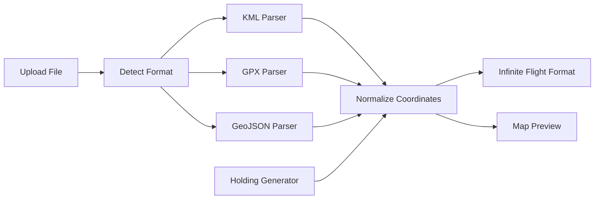

# ✈️ Infinite Flight Converter (KML / GPX / GeoJSON)

Web-based tool untuk mengubah berbagai format geospasial menjadi **flight plan yang bisa langsung di-copy ke Infinite Flight**, lengkap dengan **map preview** dan **holding pattern generator**.

---

## 🚀 Features

### ✅ Multi-Format Converter

Support:

* **KML** (Google Earth, aviation tools)
* **GPX** (GPS track)
* **GeoJSON**

➡️ Semua akan di-convert menjadi:

```
LAT,LON LAT,LON LAT,LON
```

(Siap paste ke Infinite Flight)

---

### 🗺️ Interactive Map (Leaflet.js)

* Preview route langsung setelah convert
* Auto zoom ke path
* Visualisasi polyline real-time

---

### 🔄 Holding Pattern Generator

Generate holding pattern tanpa file:

Input:

* Latitude
* Longitude

Output:

* Racetrack-style waypoint
* Langsung tampil di map

---

### ⚙️ Smart KML Parser

* Support berbagai struktur KML:

  * `<coordinates>`
  * `<gx:coord>`
* Namespace-safe (tidak tergantung format tertentu)
* Fix encoding issue (UTF-16, BOM)

---

## 📦 Installation

### 1. Clone / Download Project

Letakkan di folder web server kamu:

```
xampp/htdocs/kml-converter/
```

---

### 2. Jalankan Server

Start Apache dari:

* XAMPP / Laragon

---

### 3. Akses di Browser

```
http://localhost/kml-converter
```

---

## 📁 Project Structure

```
kml-converter/
├── index.php        # Frontend + UI + Map
├── convert.php      # API handler
└── parser.php       # Core parsing engine
```

---

## 🧠 How It Works



---

## 🧪 Supported Input Examples

### KML

```
<coordinates>
106.655,-6.125,0
106.660,-6.130,0
</coordinates>
```

### GPX

```
<trkpt lat="-6.125" lon="106.655"></trkpt>
```

### GeoJSON

```
{
  "type": "Feature",
  "geometry": {
    "type": "LineString",
    "coordinates": [[106.655,-6.125]]
  }
}
```

---

## 📤 Output Format

```
-6.125,106.655 -6.130,106.660
```

➡️ Copy → Paste ke Infinite Flight

---

## ⚠️ Known Limitations

* Holding pattern masih **basic (belum ICAO-compliant)**
* GeoJSON hanya support struktur sederhana
* Tidak ada validasi altitude

---

## 🔥 Roadmap (Next Level)

Planned upgrades:

* ✈️ ICAO Holding Pattern (teardrop / parallel entry)
* 🗺️ Drag & edit waypoint di map
* 📡 Integrasi Infinite Flight API
* 🧠 Auto detect route vs holding
* 🌐 Convert ke ICAO route (DCT, airway)

---

## 💡 Tech Stack

* PHP (Backend)
* JavaScript (Frontend)
* Leaflet.js (Map)
* OpenStreetMap (Tile)

---

## 🧑‍💻 Author

Built for:

* Flight simulation enthusiasts
* Infinite Flight users
* Aviation geeks 🚀

---

## 📜 License

Free to use for personal & educational purposes.

---

## ⭐ Final Note

Project ini bukan sekadar converter — ini fondasi menuju:

> ✈️ **Custom Flight Planning System**

Kalau kamu lanjut develop:

* tambah logic aviation
* integrasi live data
* build UI editor

➡️ kamu bisa bikin tool setara flight planner profesional.

---
